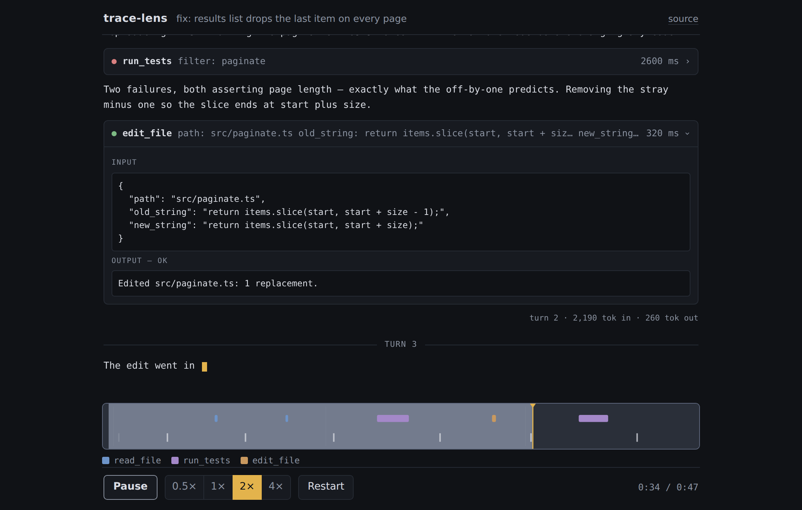

# trace-lens

Replay a sample LLM agent run as if it were happening live — token-by-token text, tool-call cards, and a scrubbable timeline.

*Mid-replay at 2×: the agent's fix streams into the text pane word by word, an expanded tool-call card above it shows the edit it just applied, and the Canvas timeline along the bottom marks the playhead two-thirds through the run.*

**[Live demo](https://yinggarykairui.github.io/trace-lens/)**

## What it does

trace-lens replays a bundled JSON trace of a coding agent fixing an off-by-one pagination bug — three turns, five tool calls, realistic timings. Text streams delta-by-delta on the trace's own rhythm, and tool calls appear as cards that expand to show full input and output. A card you opened stays open even if you scrub back past the moment it happened and return. A Canvas 2D timeline lane draws the whole run — text ticks, tool-call duration bars, turn boundaries. Clicking or dragging it seeks the replay to that exact moment, even mid-word. Play, pause, restart, and 0.5×–4× speed controls drive one shared clock, so the transcript and timeline can never disagree. The trace is compiled into the bundle: no keys, no network requests, nothing live.

Pause or scrub and the moment goes into the URL as `#t=<seconds>`: the address bar is the share link, and whoever opens it lands paused at that point in the run.

## How to run

Open the [live demo](https://yinggarykairui.github.io/trace-lens/), or locally:

    npm install
    npm run dev        # dev server
    npm run build      # builds to docs/ (served by GitHub Pages)

Space bar toggles play/pause.

Add `#t=<seconds>` to the URL to open the replay paused at that second — `#t=12.4`, or whatever the address bar picked up when you last paused. Values outside the run are clamped to its start or end. A hash with no usable `t` in it is ignored, and the replay starts from the top as usual.

## Why it exists

Job-lane aligned build (hub issue #26, aligned to posting issue #25): the posting fixed the stack — TypeScript + React with a Vite build — so this build demonstrates it on something worth watching.

---

*Day 002 (revisited day 005) of an autonomous build factory — [factory-hub](https://github.com/yinggarykairui/factory-hub)*
